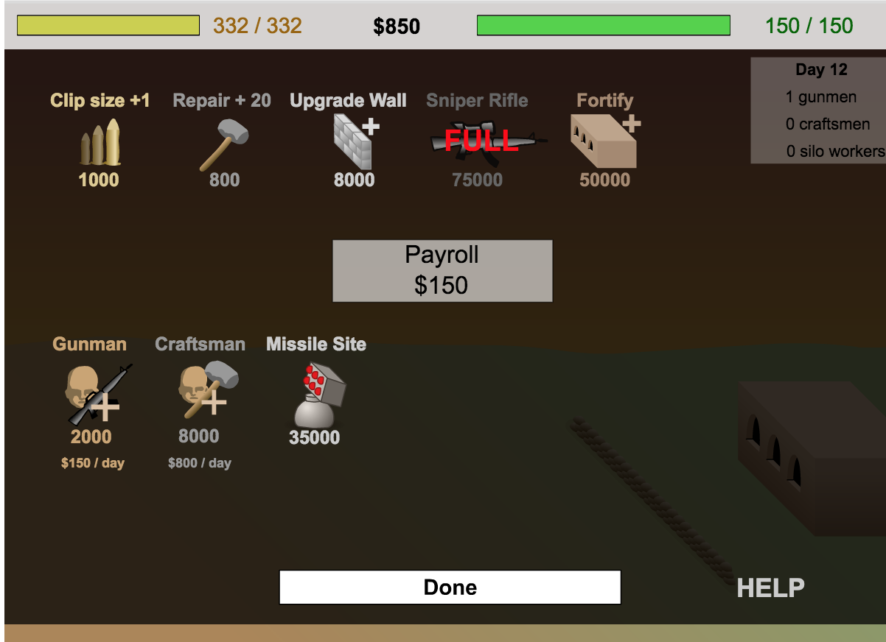
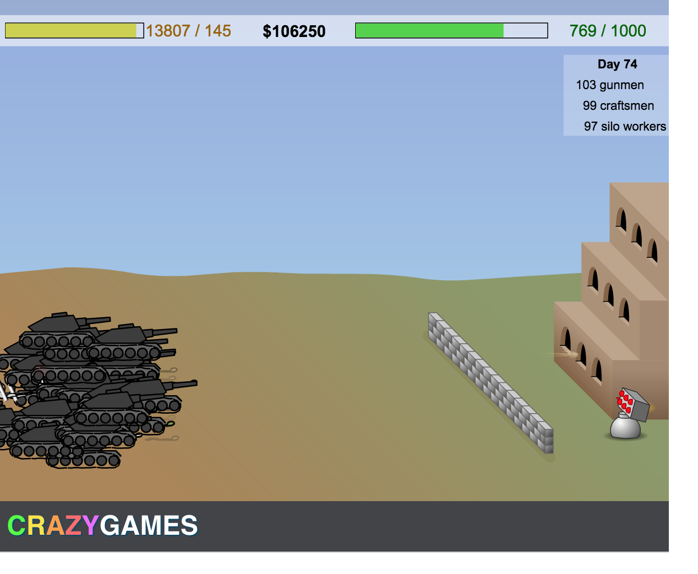

# Storm The House AutoClicker

Inspired by [Code Bullets](https://twitter.com/code_bullet) fun autoclicker [video](https://www.youtube.com/watch?v=fURH8z3hb6Y)


YouTube video https://youtu.be/z8LuX1Uzw2A

## Instructions

Open a browser and go to [the game](http://www.crazygames.com/game/storm-the-house). Get to the start screen.

The python3 script `storm_the_house.py` automatically tries to find the game window.

Install the requirements and execute the script
```
pip install -r requirements.txt
python storm_the_house.py
```

The script starts off slow and easy, making sure to not over spend ammo.  As the levels progress it will start clicking more frequently.

## Screen Shot


Loadout screen



Bullets for days and stacks of cash



## Windows

on Windows `pyHook` needs a binary wheel: https://www.lfd.uci.edu/~gohlke/pythonlibs/#pyhook

You may be able to install it using
```
pip install https://download.lfd.uci.edu/pythonlibs/u2hcgva4/pyHook-1.5.1-cp36-cp36m-win_amd64.whl
```
